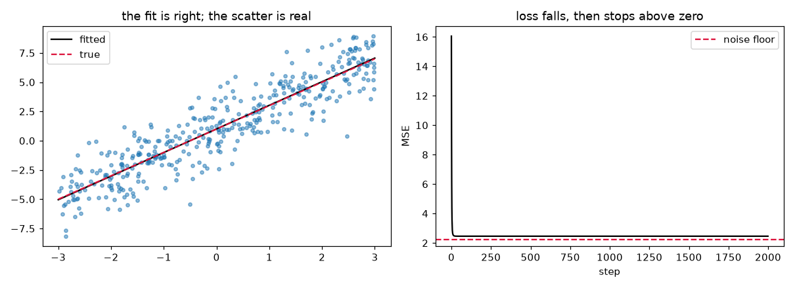
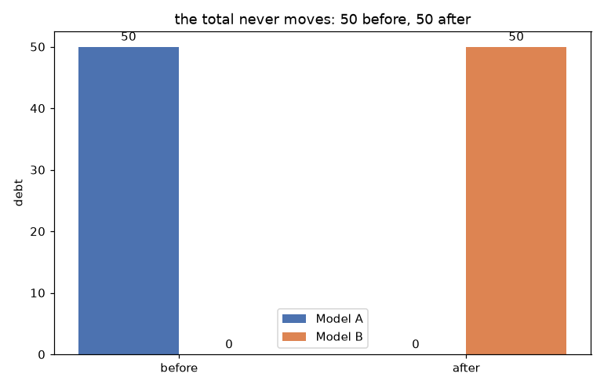
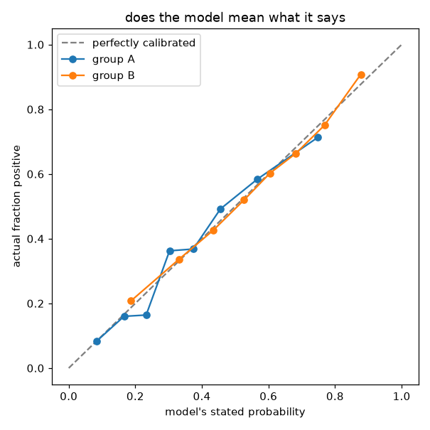
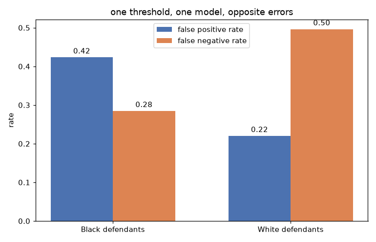

# just-and-the-justifier

An exploration of one claim: at the crucifixion, Christ served both perfect
justice and full grace. Justice was satisfied rather than waived, and grace was
extended at His own cost.

Machine learning is the vehicle here, not the subject. The repo uses small,
auditable models to make the idea legible, then looks honestly at one place
society already runs a justice-versus-mercy algorithm for real: risk assessment
in the courts.

---

## Thesis

At the cross, the offended pays the offender's debt so the offender goes free.

## The governing test

Every illustration in this repo has to **conserve the cost, not reduce it.**

Substitution keeps the full penalty and changes who pays it. Anything that only
shrinks the penalty (lowering a threshold, regularizing away past faults,
rounding down) is cheap grace, and it is cut. Where the analogy cannot conserve
the cost, the repo says so out loud. See `part2-metaphor/where-the-analogy-breaks.md`.

## How to read this repo

Four parts, two registers. Part 1 and Part 4 are essays, read them as prose.
Part 2 is code: each notebook is a `# %%` cell-marked script with a reflection
at the top and bottom, the numbers it prints are the argument. Part 3 reruns a
published analysis rather than building anything new, and reads the result
theologically in `reading.md`.

Suggested order: `part1-anchor/01-*` then `02-*`, the four part2 notebooks
in order (a, b, c, d), `part3-case-study/reproduce_the_impossibility.py` then
`reading.md`, then `part4-synthesis/`.

## Structure

| Path | What it is |
| --- | --- |
| `part1-anchor/` | Two short essays: the cross as a balanced ledger, and the conserve-versus-reduce test |
| `part2-metaphor/` | Four small notebooks using ML as a metaphor, each with a reflection, plus `where-the-analogy-breaks.md` |
| `part3-case-study/` | Reproduction and theological reading of the COMPAS fairness impossibility result |
| `part4-synthesis/` | Closing essay: what the metaphor gave and what it could not reach |

## Figures

**`part2-metaphor/a_the_loss_is_real.py`**, loss falls, then stops above zero.
The floor is real noise, not a bug to fix.



**`part2-metaphor/c_the_two_model_ledger.py`**, the centerpiece. Model A's
debt moves to Model B in full. The total on the books never changes.



**`part2-metaphor/d_calibration.py`**, the model is honest about its own
confidence, calibrated within each group. This sets up Part 3.



**`part3-case-study/reproduce_the_impossibility.py`**, one threshold, one
model, opposite error rates. This is the ProPublica finding.



## What this repo is not

It is **not** a risk-scoring tool and it does not build one. Part 3 reproduces an
already-published analysis (ProPublica's COMPAS study) to re-derive a known
mathematical result, and reads it theologically. It does not train, tune, or
propose a model that decides anything about a real person. A "grace-adjusted"
recidivism scorer would be the exact cheap grace this repo argues against, and it
would do real harm. That line is not crossed anywhere in here.

## Running the code

```bash
python3 -m venv .venv
source .venv/bin/activate        # Windows: .venv\Scripts\activate
pip install -r requirements.txt
```

The notebooks are `# %%` cell-marked Python scripts. Run them directly:

```bash
python part2-metaphor/a_the_loss_is_real.py
```

or open them as notebooks in VS Code / Jupyter (convert with `jupytext --to ipynb <file>`).

Notebook C (`c_the_two_model_ledger.py`) is the centerpiece and depends only on
the standard library.

## License

Code: MIT (`LICENSE`). Prose in `part1-anchor/`, `part3-case-study/reading.md`,
and `part4-synthesis/`: CC BY 4.0.
